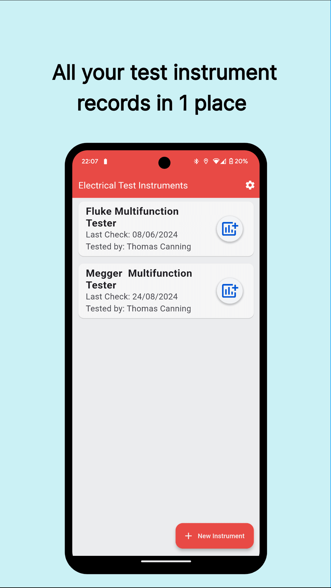
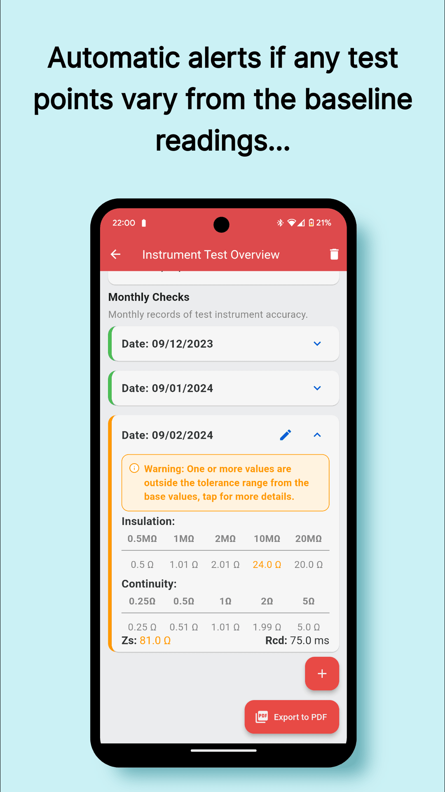
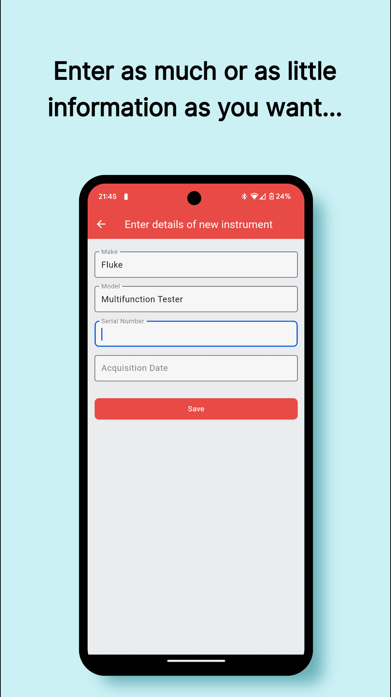

CalKeeper is the comprehensive solution for maintaining accurate and up-to-date records of the accuracy of all your test instruments.  
*Currently in open testing on the Google Play Store*.

## In App Screenshots
 
 
 
 
