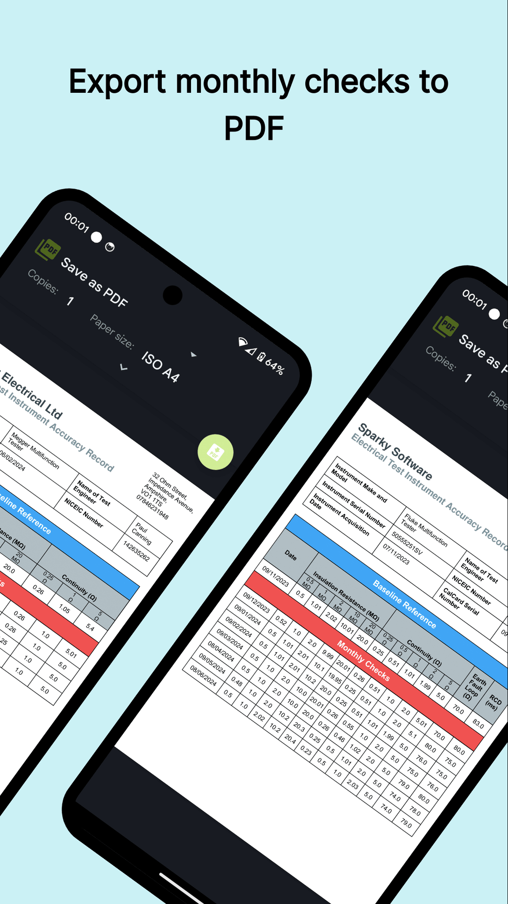
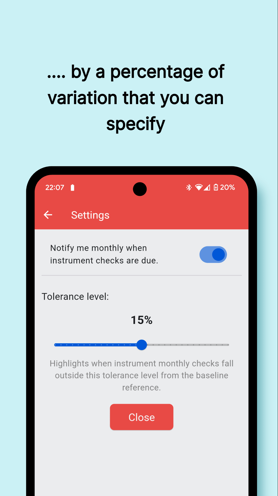
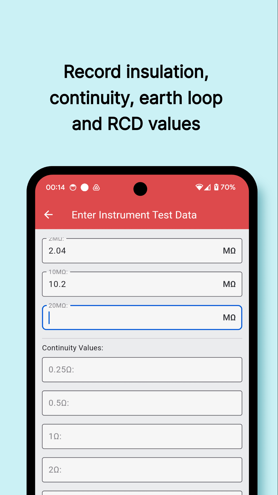
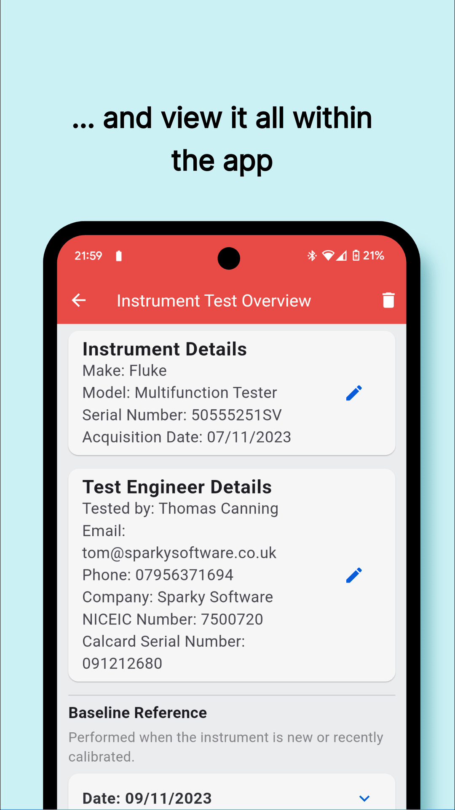

CalKeeper is the comprehensive solution for maintaining accurate and up-to-date records of the accuracy of all your electrical test instruments. 
Designed for streamlined use alongside a CalCard by UK electricians, CalKeeper makes ensuring your instruments are calibrated easy.

Key Features:
<ul>
  <li>Record insulation, continuity, earth loop, and RCD values, with the flexibility to enter as much or as little detail as you need.</li>
  <li>Export monthly check reports to PDF at the touch of a button for inspection.</li>
  <li>Receive automatic alerts when test points vary from baseline readings.</li>
  <li>Get started effortlessly with tutorial prompts guiding you through setup.</li>
</ul>
 

**Currently in open testing on the Google Play Store, with public release coming 01/10/2024 and IOS release early 2025.**

## In App Screenshots
 
 
 
 
